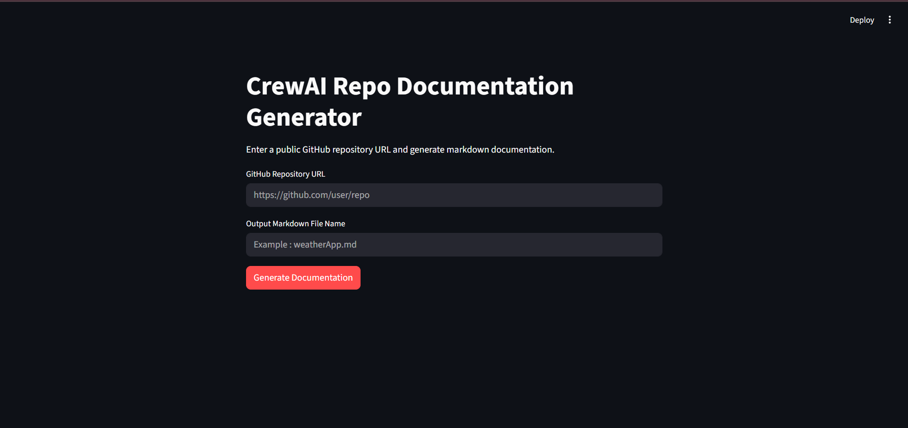
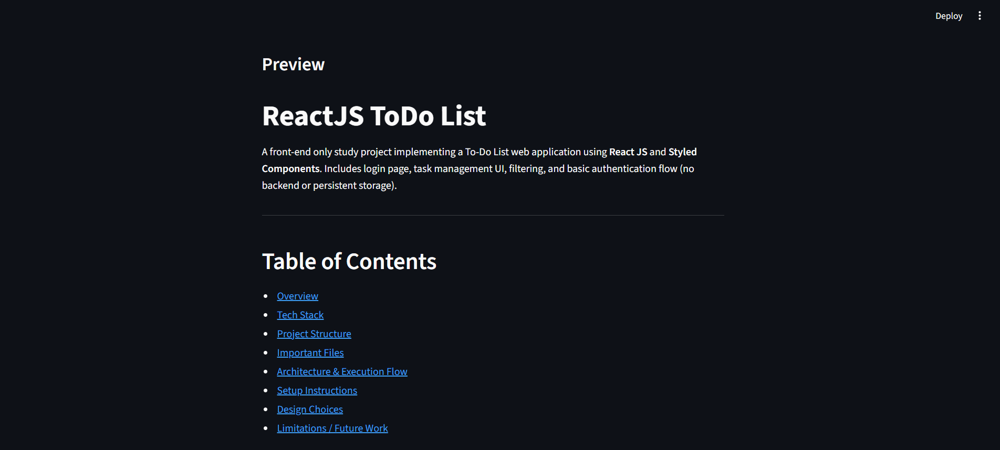

# CrewAI Repo Documentation Generator

A Streamlit app that generates markdown documentation for public GitHub repositories using a multi-agent **CrewAI** workflow.

It accepts a GitHub repository URL and an output `.md` filename, then uses specialized agents to inspect repository structure, read only the most relevant files, and produce a structured documentation file automatically.

***

## Demo

- Demo URL: `YOUR_DEMO_URL_HERE`

***

## UI Preview



### Generated Documentation Preview


***

## Features

- Generate repository documentation from a public GitHub repository URL.
- Built with a sequential CrewAI pipeline using two focused agents.
- Reads repo structure first to minimize unnecessary file fetching.
- Pulls only relevant files such as README, dependencies, entry points, config files, and core source files.
- Produces a downloadable markdown document from the Streamlit interface.
- Uses GitHub API access through a personal access token.
- Supports configurable OpenRouter models through environment variables.

***

## Tech Stack

- Python
- Streamlit
- CrewAI
- LiteLLM / OpenRouter
- GitHub REST API
- Pydantic
- python-dotenv
- Requests

***

## Project Structure

```text
.
├── .env
├── .gitignore
├── agents.py
├── app.py
├── crew.py
├── README.md
├── requirements.txt
├── tasks.py
├── tools.py
├── .vscode/
│   └── settings.json
└── generated_docs/
    └── weatherApp.md
```

***

## How It Works

### 1. Streamlit UI

The `app.py` file provides a simple interface where the user enters:

- A public GitHub repository URL
- The output markdown filename

When the **Generate Documentation** button is clicked, the app validates the inputs and triggers the CrewAI pipeline.

### 2. Crew Orchestration

The `crew.py` file creates a CrewAI crew with:

- `repo_researcher`
- `doc_writer`

The process runs sequentially so repository analysis happens first, followed by markdown generation.

### 3. Research Task

The first task in `tasks.py` tells the researcher agent to:

- Inspect repository structure first
- Identify important files
- Fetch only relevant file contents one by one
- Avoid unnecessary token usage

### 4. Writing Task

The second task takes the repository analysis and writes a polished markdown document to:

```text
generated_docs/{file_name}
```

### 5. GitHub Tools

The custom tools in `tools.py` handle:

- Parsing GitHub repository URLs
- Reading repository tree structure via GitHub API
- Fetching single file contents from a repository
- Truncating oversized file content for efficiency

***

## Agents

### `repo_researcher`

Responsible for understanding the repository efficiently by:

- Checking the repo tree first
- Selecting only important files
- Reducing unnecessary token and API usage

### `doc_writer`

Responsible for converting repository analysis into clear, developer-friendly markdown documentation.

***

## Setup

### 1. Clone the Repository

```bash
git clone https://github.com/your-username/your-repo.git
cd your-repo
```

### 2. Create and Activate Virtual Environment

```bash
python -m venv venv
```

**Windows**

```bash
venv\Scripts\activate
```

**macOS / Linux**

```bash
source venv/bin/activate
```

### 3. Install Dependencies

```bash
pip install -r requirements.txt
```

### 4. Configure Environment Variables

Create a `.env` file in the root directory:

```env
GITHUB_PERSONAL_ACCESS_TOKEN=your_github_token_here
OPENROUTER_API_KEY=your_openrouter_api_key_here
OPENROUTER_MODEL=openrouter/microsoft/phi-3-mini-128k-instruct:free
```

***

## Run the App

```bash
streamlit run app.py
```

Then open the local Streamlit URL in your browser.

***

## Input Requirements

- The repository URL must be a valid public GitHub repository.
- The output filename must end with `.md`.
- A GitHub personal access token is required in `.env`.

***

## Example Workflow

1. Enter a repository URL such as `https://github.com/user/repo`.
2. Enter an output filename such as `project_docs.md`.
3. Click **Generate Documentation**.
4. Wait for the agents to analyze the repository.
5. Preview the generated markdown inside the app.
6. Download the generated documentation file.

***

## Key Files

| File | Purpose |
|---|---|
| `app.py` | Streamlit UI for taking user input, showing preview, and downloading markdown |
| `crew.py` | Builds and runs the CrewAI workflow |
| `tasks.py` | Defines research and writing tasks for the agents |
| `agents.py` | Configures CrewAI agents and LLM settings |
| `tools.py` | Provides custom GitHub repository inspection and file-reading tools |
| `generated_docs/` | Stores generated markdown output files |

***

## Notes

- The tools default to the `main` branch when inspecting a repository.
- Large file contents are truncated to control token usage.
- The app is designed for public repositories and targeted file retrieval rather than full-repo ingestion.
- The generated output path is controlled by the CrewAI task configuration.

***

## Future Improvements

- Support automatic default branch detection when `main` is unavailable.
- Add repository metadata such as stars, language stats, and topics.
- Add multiple markdown templates.
- Support exporting documentation in additional formats.
- Improve error handling for invalid repositories and API rate limits.
- Add screenshot gallery and live demo link in the README.

***

## Author

Akshay Gite